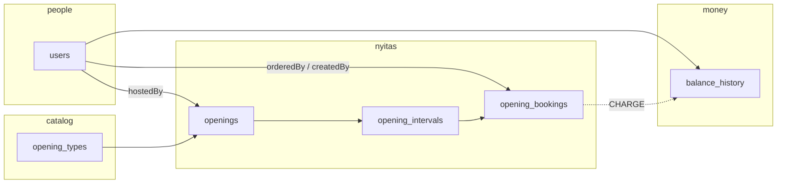
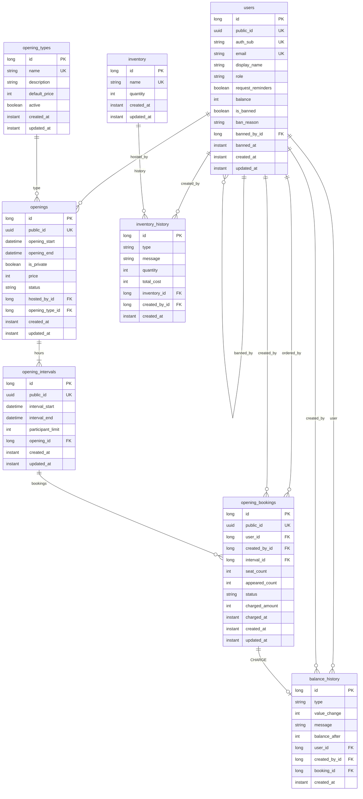
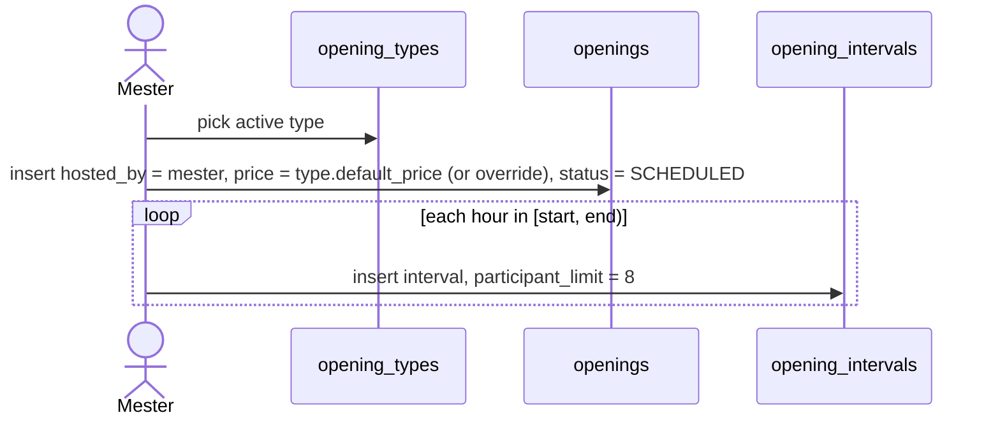
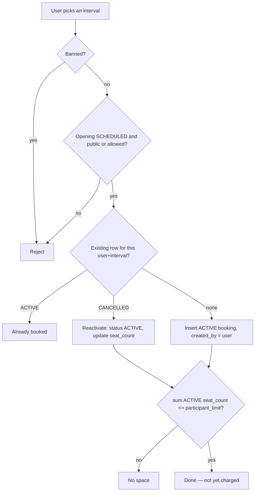
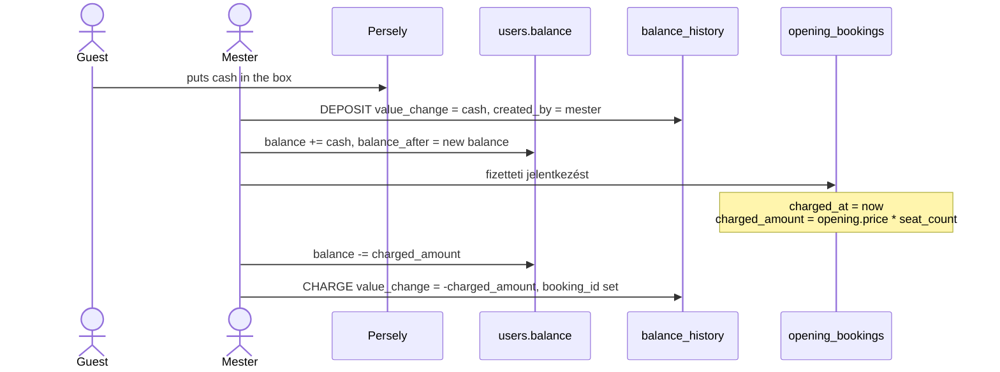
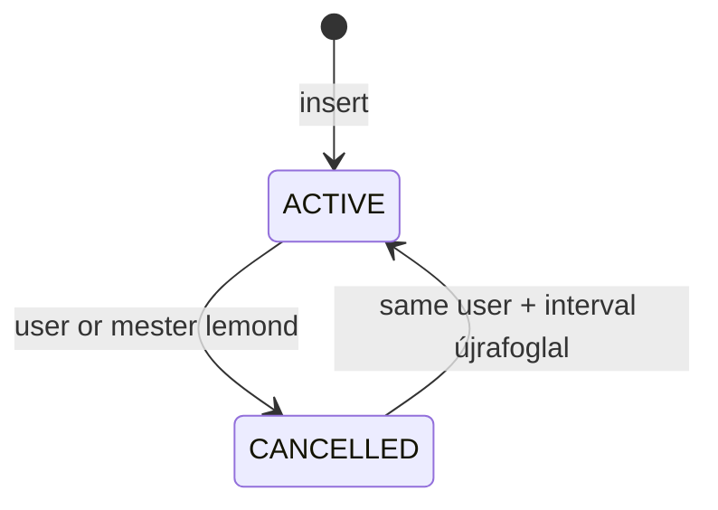
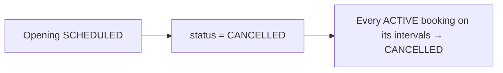
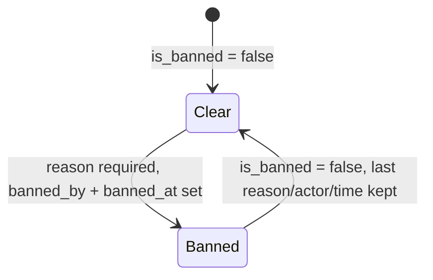
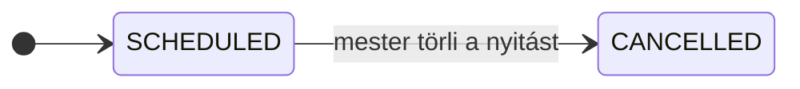

# Szauna-Web domain model

Booking and cash-box (persely) management for Szauna Kör. This document describes the **current persistence model**: tables, relationships, money, nyitás/foglalás workflows, and the rules the future service layer must enforce. There is no REST API yet.

Amounts are **physical cash** counted in the persely, denominated in **JMF**. There is no card or payment-provider integration.

Wall-clock times (`opening_start`, `interval_start`, …) are `LocalDateTime` in **Europe/Budapest**. Audit timestamps (`created_at`, `updated_at`) are UTC `Instant`.

---

## Overview

A szauna mester **ír ki** a nyitás (typically 3 hours). The nyitás is split into **1-hour intervals**. Users **jelentkeznek** onto those hours for one or more seats (~8 capacity). Payment is prepaid JMF: cash goes into the persely, the mester records a deposit, then **fizetteti** the booking and JMF is deducted.



Inventory (illóolaj) is a parked side module: tables exist, no product workflow yet.

---

## Entity-relationship diagram



Composition vs reference:

- An **opening owns its intervals** (`CascadeType.ALL` + `orphanRemoval`). Deleting or rebuilding the interval list of a nyitás is a structural edit of that nyitás.
- **Bookings, ledger rows, and inventory history are not owned** by the user/type/item. Deleting a user or an opening type must **not** wipe occupancy or money.

---

## Identifiers

Every table has a surrogate `id` (`BIGINT IDENTITY`).

API-facing aggregates also have a UUID v7 `public_id` (not updatable):

| Table | `public_id` |
|---|---|
| `users` | yes |
| `openings` | yes |
| `opening_intervals` | yes |
| `opening_bookings` | yes |
| `opening_types` | no |
| `balance_history` | no |
| `inventory` / `inventory_history` | no |

Internal FKs use `id`. External APIs should use `public_id`.

`equals` / `hashCode` are identity-based: two entities are equal only if both have a persisted `id` (`id != 0`) and the ids match. Unsaved instances are never equal. Hash code is stable across persist (class, not id).

---

## Roles

`users.role` (`STRING` enum):

| Role | Meaning |
|---|---|
| `USER` | Default. Sees openings, books seats, sees own balance. |
| `SAUNA_MASTER` | Writes nyitások, hosts them, records persely cash, charges bookings, bans, walk-ins. |
| `ADMIN` | Promotes users to mester; sees everything a mester sees. |

There is no “próbás” rank and no PéK-driven roles in this schema. Circle membership / discounts are out of scope.

---

## Tables

### `users`

AuthSCH-backed account plus prepaid JMF and ban state.

| Column | Notes |
|---|---|
| `auth_sub` | AuthSCH subject; unique, immutable |
| `email` | Unique |
| `display_name` | What mesterek see at the desk |
| `role` | See [Roles](#roles); default `USER` |
| `balance` | Prepaid JMF from persely deposits (can be used as a running total; source of truth for history is `balance_history`) |
| `request_reminders` | Opt-in for future reminder mails; default `true` |
| `is_banned` | Current ban flag |
| `ban_reason` | **Required when** `is_banned = true` |
| `banned_by_id` / `banned_at` | Who banned and when |
| `created_at` / `updated_at` | Audited |

Unban sets `is_banned = false` and **keeps** the last reason/actor/time so the conversation context is not lost.

Unique: `public_id`, `auth_sub`, `email`.

### `opening_types`

Editable catalogue (e.g. sima, jeges, szörpös).

| Column | Notes |
|---|---|
| `name` | Unique |
| `description` | Optional |
| `default_price` | Fix ár: **JMF per person per hour**, `>= 0` |
| `active` | `false` retires a type without deleting historical nyitások |

Do not delete a type that still has openings. Change `active` instead.

### `openings`

One kiírás. Typical shape: 3 hours, hosted by the mester who posted it.

| Column | Notes |
|---|---|
| `opening_start` / `opening_end` | `opening_end > opening_start` (check) |
| `is_private` | Not a public listing; the host is still `hosted_by_id` |
| `price` | Snapshot of `opening_types.default_price` at kiírás; override allowed. Same unit: JMF / fő / óra |
| `status` | `SCHEDULED` or `CANCELLED` |
| `hosted_by_id` | Who írta ki — they will be there |
| `opening_type_id` | Required |

Past vs upcoming is **not** a status: a scheduled nyitás with `opening_end < now` is simply over. There is no `COMPLETED` value.

Indexes: `opening_start`, `hosted_by_id`.

### `opening_intervals`

One bookable hour (or slot) of a nyitás.

| Column | Notes |
|---|---|
| `interval_start` / `interval_end` | `interval_end > interval_start` (check) |
| `participant_limit` | Default **8**, `>= 1` |
| `opening_id` | Parent nyitás |

Unique: `(opening_id, interval_start)` — no duplicate slots.

A 3-hour nyitás is three interval rows. Bookings attach to intervals, not to the opening as a whole.

### `opening_bookings`

One **reservation**: user X reserved N seats on one interval. Not a person row.

| Column | Notes |
|---|---|
| `user_id` | `ordered_by` — whose jelentkezés |
| `created_by_id` | Who created the row (the user, or the mester on walk-in) |
| `interval_id` | The hour |
| `seat_count` | How many people, `>= 1` |
| `appeared_count` | `null` = attendance not taken; `0` = nobody showed |
| `status` | `ACTIVE` or `CANCELLED` |
| `charged_amount` | JMF actually deducted (snapshot) |
| `charged_at` | **Paid flag:** non-null ⇔ fizettetve |

Unique **always**: `(user_id, interval_id)`. Cancel does not delete. Re-booking the same user on the same hour **reactivates** this row (update `seat_count` / `created_by` as needed).

Indexes: `interval_id`, `status`.

There is no waiting list. There is no “exclusive full sauna” flag: filling `participant_limit` just occupies the seats. Private events use `openings.is_private`.

### `balance_history`

Append-only **cash ledger**. No `updated_at`.

| Column | Notes |
|---|---|
| `type` | `DEPOSIT`, `CHARGE`, `ADJUSTMENT` |
| `value_change` | Signed JMF (positive credit, negative debit) |
| `message` | Optional comment |
| `balance_after` | `users.balance` after this row |
| `user_id` | Whose balance |
| `created_by_id` | The mester who counted cash / charged / adjusted |
| `booking_id` | Set on `CHARGE`; null otherwise |

Index: `(user_id, created_at)`.

| Type | Meaning |
|---|---|
| `DEPOSIT` | Cash put in the persely, credited to the user |
| `CHARGE` | Prepaid JMF deducted for a booking |
| `ADJUSTMENT` | Manual correction |

### `inventory` / `inventory_history`

Parked illóolaj stock. Unique item `name`. History types: `USED`, `BOUGHT`, `ADJUSTMENT`. `created_by_id` is required on every movement. `total_cost` is physical cash when buying stock. No FK to a nyitás yet.

---

## Workflows

### 1. Kiírás (create a nyitás)



Rules:

- Host is the mester who posts it (`hosted_by_id`).
- Copy `default_price` onto `openings.price` at insert time so later type edits do not rewrite history.
- Generate one interval per hour (spec: 3-hour üzem, 1-hour bookings). Intervals must lie inside `[opening_start, opening_end]`.

### 2. Jelentkezés (self-signup)



A booking does **not** move money. Prepaid JMF is deducted only when the mester fizetteti (workflow 4).

Overbooking (`sum(ACTIVE.seat_count) <= participant_limit`) is **not** a database CHECK; the service must enforce it.

### 3. Walk-in

Someone shows up and there is space. There is no várólista.

- If the guest already has a row for that interval: reactivate / bump `seat_count` if needed.
- Else insert `opening_bookings` with `ordered_by = guest`, `created_by = mester`.

The guest must already be a `users` row (AuthSCH). Anonymous walk-ins are not modeled.

### 4. Persely and fizettetés



**Charge formula** (one booking row = one interval = one hour):

```
charged_amount = openings.price × opening_bookings.seat_count
```

A 2-person, 3-hour jelentkezés is **three** booking rows and three charges (or three `CHARGE` lines).

Paid means `charged_at IS NOT NULL` (so a future 0-JMF charge can still be “fizettetve”). Writing `charged_at` / `charged_amount` and the `CHARGE` ledger row must happen in **one transaction**. Do not charge twice: if `charged_at` is already set, skip.

`DEPOSIT` is not tied to a booking. Users can prepay; the mester can also record cash and charge in the same visit.

### 5. Cancel a foglalás

Set `status = CANCELLED`. Do not delete the row (unique `(user, interval)` and stats depend on it).

If already charged, refund policy is **not specified** yet. Until it is, do not invent a reverse `CHARGE`; an `ADJUSTMENT` or a later `DEPOSIT` would be an explicit mester action.

Re-book: same row → `ACTIVE` again.



### 6. Cancel a nyitás



Hard-delete is not the cancel path. Intervals stay. Bookings stay as `CANCELLED`. Notifications (“elmarad a nyitás”) can use this status later.

### 7. Attendance

After the hour, the mester may set `appeared_count` (`null` → not taken, `0..seat_count`). No-show punishment is **not decided**; the column is there for stats and a later büntetés.

### 8. Ban / unban



A banned user must not create `ACTIVE` bookings (service rule). Existing bookings are not auto-cancelled by the schema.

### 9. Inventory (later)

Mester/admin `BOUGHT` / `USED` / `ADJUSTMENT` with `created_by`. Update `inventory.quantity` in the same transaction as the history row. Not wired to nyitások.

---

## Rules cheat-sheet

Invariants the **database** already enforces:

| Rule | How |
|---|---|
| Unique AuthSCH / email / public ids | unique constraints |
| Unique opening-type name | `uq_opening_type_name` |
| One slot per `(opening, interval_start)` | `uq_opening_interval_slot` |
| One booking row per `(user, interval)` | `uq_opening_booking_user_interval` |
| `opening_end > opening_start` | check `ck_openings_range` |
| `interval_end > interval_start` | check `ck_opening_intervals_range` |
| `seat_count >= 1`, `participant_limit >= 1`, prices `>= 0` | Bean Validation (`@Min`) |
| Ban reason when banned | `@AssertTrue` on `UserEntity` |

Invariants the **service layer** must enforce (not CHECK constraints):

| Rule | Detail |
|---|---|
| Copy type price at kiírás | `openings.price` starts as `opening_types.default_price` |
| Intervals cover the nyitás | Usually 1-hour slices, default limit 8 |
| No overbooking | `sum(ACTIVE.seat_count) <= participant_limit` |
| No waiting list | Never insert a queue row |
| Walk-in vs self-signup | `created_by` is mester vs user |
| Fizettetés is atomic | `CHARGE` ledger + `users.balance` + `charged_at` / `charged_amount` together |
| Idempotent charge | Skip if `charged_at` already set |
| Charge amount | `price * seat_count` for that interval |
| Cancel nyitás | Opening `CANCELLED` and all `ACTIVE` bookings `CANCELLED` |
| Re-book | Reactivate the existing row, do not insert a second |
| Do not cascade-delete money/occupancy | Never `remove(user)` expecting ledger/bookings to go |
| Retire types with `active = false` | Do not delete types that have openings |
| Banned users | No new `ACTIVE` bookings |
| Inventory quantity | Keep in sync with history in one transaction |

---

## Status and enum reference



| Enum | Values |
|---|---|
| `UserRole` | `USER`, `SAUNA_MASTER`, `ADMIN` |
| `OpeningStatus` | `SCHEDULED`, `CANCELLED` |
| `BookingStatus` | `ACTIVE`, `CANCELLED` |
| `BalanceChangeType` | `DEPOSIT`, `CHARGE`, `ADJUSTMENT` |
| `InventoryHistoryType` | `USED`, `BOUGHT`, `ADJUSTMENT` |

All stored as `STRING`, never ordinal.

---

## JPA notes (for implementers)

- Entities are `class`, not `data class`.
- `BaseEntity` holds `id` + Hibernate-safe `equals`/`hashCode`.
- Mutable aggregates extend `AuditedEntity` (`created_at`, `updated_at`). Ledger/history tables only have `created_at`.
- `@EnableJpaAuditing` is on; there is no `AuditorAware` yet — set `hosted_by` / `created_by` explicitly in services.
- Every `@ManyToOne` is `LAZY`.
- JDBC timezone: `Europe/Budapest` (`application.properties`).

Schema is still evolving; H2 + Hibernate `ddl-auto` is acceptable until Flyway is introduced.

---

## Out of scope (not in this schema)

- AuthSCH profile sync beyond `auth_sub` / `email` / `display_name`
- PéK körtagság, ÁB/KB kedvezmény, bérlet, törzsvendég
- Generic `audit_log` table (actor FKs on the rows are the log)
- CMS (szabályzat, hírek, galéria)
- Email / calendar invites beyond `request_reminders`
- Inventory UI and “used on this nyitás”
- Overbooking exclusion constraint in SQL
- Refund policy after a charged booking is cancelled
